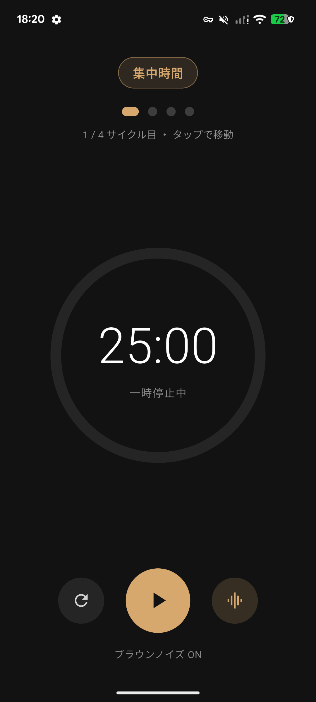
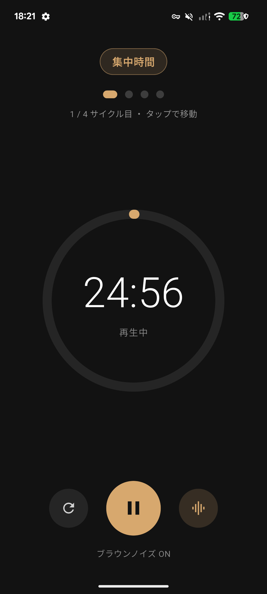
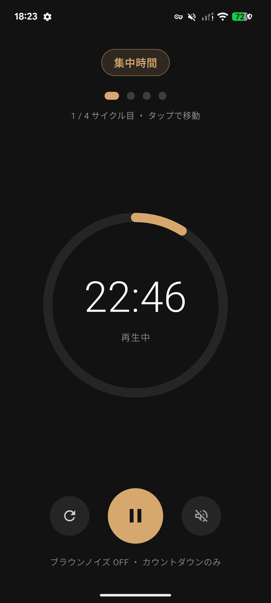
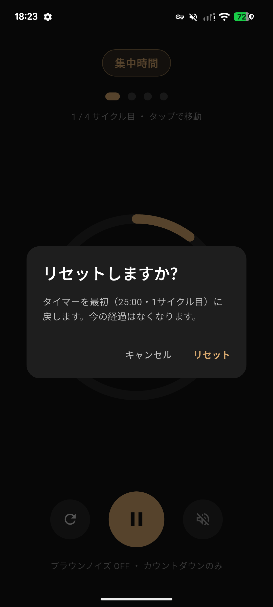
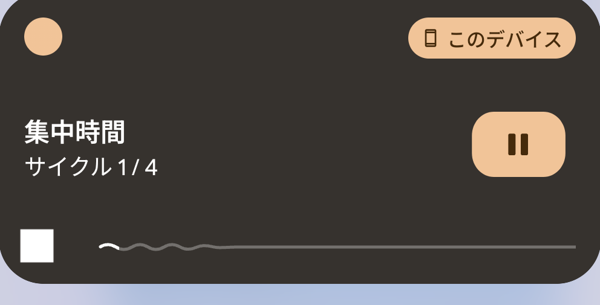

# Brown Focus

外出先でも集中できる、**ブラウンノイズ付きポモドーロタイマー** (Flutter / Android)。

集中（25分）と休憩（5分）を4サイクル繰り返し、4回目の後に長い休憩（20分）を挟みます。背景にブラウンノイズをシームレスにループ再生し、画面を消してもタイマーと音が止まりません。ブラウンノイズはオフにでき、その場合はカウントダウン音だけの普通のポモドーロタイマーとして使えます。

<p align="center">
  
  
  
  
</p>

## 主な機能

- **ポモドーロ・サイクル**: 集中 25 分 → 短い休憩 5 分を 4 回、4 回目の後は長い休憩 20 分。終わると 1 サイクル目へ戻ります。
- **フェーズで変わる背景音**: 集中中はブラウンノイズ、休憩中はより柔らかいうねりのある音に自動で切り替わります。
- **バックグラウンド再生**: `audio_service` のフォアグラウンドサービスでプロセスを保持。画面オフ・アプリ切り替え中もタイマーと音が継続します。
- **ブラウンノイズ ON / OFF**: OFF にすると音源を止め、カウントダウン音のみの純粋なタイマーになります。
- **フェーズ切り替え音**: 各フェーズの終了 3 秒前にカウントダウン音を再生。
- **サイクルの途中参加**: サイクルのドットをタップして、任意のサイクルの集中時間から開始できます。
- **操作ミス防止**: リセットとサイクル移動には確認ダイアログを表示します。
- **ダークな UI**: 屋外でも見やすい、シンプルでモダンな配色。残り時間・フェーズ・サイクルがひと目で分かります。

## バックグラウンド再生・通知

タイマー作動中はメディア通知を表示し、そこから再生／一時停止を操作できます。アプリをバックグラウンドに送っても、フォアグラウンドサービスによって音とタイマーは動き続けます。

<p align="center">
  
</p>

実機 (Pixel 6a / Android 16) で、アプリをホームに送った状態でも以下を確認済みです。

- フォアグラウンドサービス稼働: `isForeground=true`, タイプ `mediaPlayback`, 通知フラグ `ONGOING | NO_CLEAR | FOREGROUND_SERVICE`
- 音声再生継続: `AudioPlaybackConfiguration ... state:started usage=USAGE_MEDIA sampleRate=44100`
- タイマー継続: バックグラウンド滞在中も残り時間が進行

## 使用パッケージ

| 目的 | パッケージ |
| --- | --- |
| 状態管理 | [flutter_riverpod](https://pub.dev/packages/flutter_riverpod) |
| 音声再生 | [just_audio](https://pub.dev/packages/just_audio) |
| バックグラウンド／通知 | [audio_service](https://pub.dev/packages/audio_service) |
| リアクティブストリーム | [rxdart](https://pub.dev/packages/rxdart) |
| ランチャーアイコン生成 | [flutter_launcher_icons](https://pub.dev/packages/flutter_launcher_icons) |

## セットアップ

前提: Flutter SDK と Android 実機／エミュレータ。

```bash
# 依存関係を取得
flutter pub get

# ランチャーアイコンを生成（任意・アイコンを変更したとき）
dart run flutter_launcher_icons

# 実行
flutter run
```

### 音声アセット

`assets/audio/` に以下の 2 ファイルを配置します（本リポジトリにはサンプルを同梱）。

- `brown_noise.mp3` — ループ用ブラウンノイズ。継ぎ目でクリック音が出ないよう、シームレスにループする素材を推奨。
- `countdown.mp3` — フェーズ切り替え前のカウントダウン（約 3 秒）。

差し替える場合は同じファイル名で上書きしてください。

## プロジェクト構成

```
lib/
  main.dart                            # AudioService 起動 + Riverpod のルート
  config.dart                          # 25/5/20・4サイクルなどの設定値
  models/pomodoro_state.dart           # フェーズ enum とタイマー状態モデル
  services/pomodoro_audio_handler.dart # タイマー・音声・通知の中核ロジック
  providers/pomodoro_providers.dart    # Riverpod プロバイダ
  screens/home_screen.dart             # ダークテーマの UI
assets/audio/                          # brown_noise.mp3 / countdown.mp3
docs/screenshots/                      # README 用スクリーンショット
```

## 動作確認済み環境

- Flutter (Dart SDK 3.12+)
- Android 実機: Google Pixel 6a (Android 16 / API 36)

## ライセンス

MIT License. 詳細は [LICENSE](LICENSE) を参照してください。
